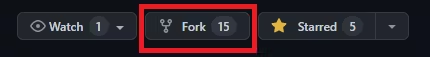
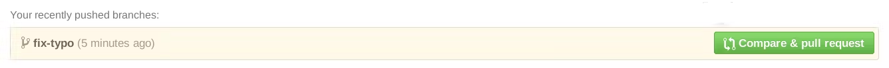

# Contributing to Open Source Project
## A. Setting Up The Project

**Step 1.** Fork the project.



**Step 2.** Open Git Bash in the folder where you wish to work on the project in your system and clone your forked copy of the project.
```bash
git clone https://github.com/<your-account-username>/<your-forked-project>.git
```
**Step 3.** Move to the project folder.
```bash
cd <your-forked-project-folder>
```
**Step 4.** Add a reference to the original repository.
```bash
git remote add upstream https://github.com/<author-account-username>/<original-project>.git
``` 
**Step 5.** Check the remotes for this repository.
```bash
git remote -v
```
**Step 6.** Always take a pull from the upstream repository to your main branch to keep it at par with the main project(updated repository).
```bash
git pull upstream main
```
## B. Contributing To The Project

**Step 1.** Create a new branch (Do not name it 'main', 'master' or anything random).
```bash
git checkout -b <your_branch_name>
```
**Step 2.** Perform your desired changes to the code base.

**Step 3.** Track your changes.
```bash
git add .
```
**Step 4.** Commit your changes.
```bash
git commit -m "<commit message>"
```
**Step 5.** Push your changes.
```bash
git push -u origin <your_branch_name>
```

**Step 6.** Go to GitHub. Then, head over to your forked repo and click on "Compare and pull request".



You have made a PR. Now, the project maintainers will review your PR and merge it.
---
---

# ISSUE:
I was committing to my GitHub repository from the Git terminal for some days. The commits were done successfully, but they were not shown on my activity graph. The problem was that the GitHub email and the Git config email I had provided were different. You can check it by using the command "git config user.email" in the terminal.
- git config --global user.email "imran1nawar@gmail.com"
- git config --global user.name "ImranNawar"

---
---
## LINKS:
Namecheap Affiliate Link:
https://namecheap.pxf.io/c/1299552/386170/5618

RANDOM IMAGES:
https://picsum.photos/400/256

Netlify:
http://www.netlify.com
forms netlify.com  //for form method which will funtional

## Java Setup:
- install jdk-19
- set three paths (bin path, oracle path, and jdk path)
- for confirmation (java --version in cmd)
- video url:   `https://youtu.be/WNfvAciOtL4`
- Install netbeans


## Setup for c++ programming in visual studio code:
- Gcc Compiler:
- MinGw : extract mingw from the file and then add the path
- Extensions in VS code for c++: Code Runner and C/C++
- check the box code runner run in terminal in vs code.
- video url: `https://youtu.be/jvg4VtYEhKU`

## Python setup:
- install python-3.11.2-amd64
- pip will also be installed
- set two paths, python and Scripts
- for confirmation(python --version, pip --version)
- install packages: pip install numpy (in terminal)    etc;
- update pip: python -m pip install --upgrade pip

## Javascript setup:
- install node-v18.12.1-x64
- for confimation: node --version, npm --version
- set path;
- install packages: npm install jest (in terminal) etc

## React Application setup:
To create React app:
```bash
npx create-react-app myapp
```
```bash
yarn create-react-app imagesearch
```

```bash
npx create-vite country-information --template react
cd country-information
npm install
npm run dev
```
### Awesome react resources
<a href="https://github.com/enaqx/awesome-react#react-community">Resources</a>
